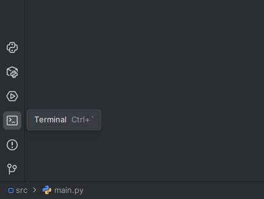

> This repository was made for a Home Project as part of the B-OOPROG course at Gábor Dénes University.

JetPass is a simple, interactive console-based flight reservation system built with Python.

## Features

- **View Flights**: Browse available flights with detailed info including airline, flight number, origin, destination, price, and dates.
- **Reserve Flight**: Select flights to reserve tickets which are saved persistently.
- **View Reservations**: See all your saved reservations with ticket details.
- **Delete Reservation**: Remove unwanted reservations easily.
- **Persistent Storage**: Reservations are saved and loaded from a JSON file.
- **Rich UI**: Utilizes the rich library for beautified terminal tables and questionary for interactive prompts.

#### Dependencies

- Pandas: CSV management.
- Rich: Beautifies tables within command line interfaces.
- Questionary: Turns console prompts interactive / allows styling.
- Prompt-toolkit: Dependency to Questionary.

This project also includes a `requirements.txt` which can be used to install all dependencies like so:

```sh
pip install -r requirements.txt
```

#### Compatibility

This program requires a dedicated command line to run! If you are using an IDE like PyCharm, you will need to select the terminal and run the project using:

```sh
py .\main.py
```



#### Install

You can clone this project using:

```sh
git clone https://github.com/Py-xel/JetPass.git
```
